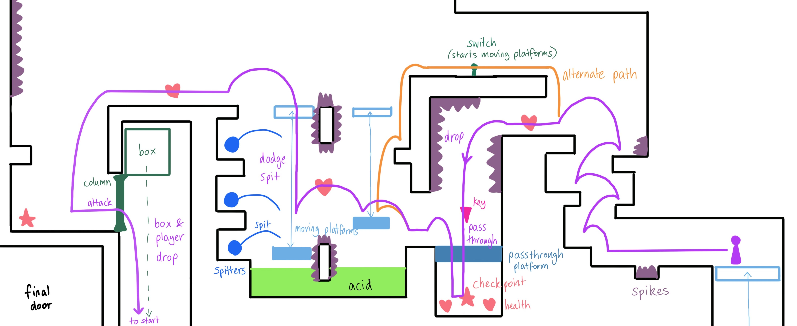

# COMP2150  - Level Design Document
### Name: Felicity Nop
### Student number: 47681837

This document discusses and reflects on the design of your platformer level for the Level Design assessment. It should be 1500 words. Make sure you delete this and all other instructional text throughout the document before checking your word count prior to submission. Hint: You can check word count by copying this text into a Word or Google doc.

## 1. Player Experience

### 1.1. Discovery
My level scaffolds discovery of the key concepts and verbs I wanted to highlight - 'push' boxes and 'open' doors/bridges - through effective use of space to indirectly guide the player.

These main verbs are introduced in section 1. The encounter space was designed such that the player must ‘push’ the box forward to progress (cannot jump over), teaching them the activate button -> open bridge mechanic. 
Section 3 is the cumulation of sequential switch activations to 'open' and 'close' multiple doors as well as a multi-staged box 'push'. The arrangement of encounters in that part of the level creates a memorable space, with the “next” objective/door visible on the player’s screen. This more challenging scenario using previously-taught verbs forces discovery and mastery of switch mechanics, and facilitates the development of problem solving dynamics.
Originally, the plan was to use bridges instead of doors, as I believe the toggle state doors conflict with the idea that "doors will close if the button isn't held down", but mechanics limitations changed this.

Additionally, the player’s initial confusion about the column blocking the right of the starting area is resolved after completing section 1 and discovering the ‘attack to break column’ mechanic, providing them with an “I know how to get through now!” moment as a reward for completing section 1 and an incentive to continue.

 
*Discovery of the box push strategy.*

*The barrier between sections 1 and 2 can only be broken after completing section 1.*

### 1.2. Drama
The overall intensity curve holds section 1 as the hook, as the player learns different mechanics and dynamics through interesting encounter design. Section 2 represents the rising action, as figuring out each step towards the greater goal creates several moments of puzzlement and achievement. Section 3 represents the climax, as it is the most challenging part of the level and has the most complexity in its solution. Every encounter in the level addresses mechanics in different ways, avoiding boredom by repetition. Higher intensity encounters in sections 1 and 2 are connected to “safe” areas, allowing for dips and bumps in intensity.

The transition elevator between sections 2 and 3 is a shift from a tight underground space to an open floating space. This connecting space is intentionally long to create resonance, allowing the player to feel the satisfaction of completing the last section and a moment of respite before the upcoming tension.

The forked path and spike drop at the entrance of section 3 were arranged so the player has incomplete knowledge of what lies ahead, pitting curiosity against the possibility of danger. This, along with some randomness of the spitter attacks and moving platform timings, creates uncertainty and tension. Tension is also created through the scarcity of health pickups and checkpoints (rewards) compared to the many threats (penalties), emphasising careful selection of actions and increasing dramatic intensity.

*The layout works with the game's viewport size to ensure incomplete knowledge of what lies past the drop or above the chomper.*

### 1.3. Challenge
The main challenges of my level are around discovering the different applications of boxes and switches, particularly in the final part of section 3. Each encounter in the level contributes towards moments of tension and relief as the player solves puzzles or overcomes enemies/obstacles, with complexity and difficulty of encounters increasing through sections.

Section 3 increases in complexity as a combination of the mechanics and verbs used in previous sections is required to solve the final box push/doors puzzle. Physical skill is challenged particularly in the S-shaped path (spikes were placed to encourage precise movement inputs) and spitters/moving platform parkour (targeting reflexes and precision platforming). Intellectual problem-solving and analytical skills are required to understand and solve the doors puzzle.

The level aims to maintain flow by balancing intense threats with minimally dangerous spaces (e.g. the spitters vs tunnels in section 2) to modulate the level of difficulty. The player is able to see their objectives clearly (often a switch or a door) due to the arrangement of encounters and receives immediate feedback to actions (e.g. doors opening loudly and visibly). Minimal red herrings/distractions also contribute towards streamlining objectives and maintaining flow.

*Section 2 connects a high-intensity shootout with low-intensity traversable tunnels.*

### 1.4. Exploration
Although section 1 is mostly linear, sections 2 and 3 increase the number of ways to navigate the space, with different paths having different purposes. Encounters sit at different elevations and aesthetic settings, varying between being cramped (section 2) to plein-air (section 3), fitting with the narrative theme of moving from underground to the skies.

Sections 1 and 3 connect the player to the start, establishing the final key door as a central landmark for the player's mental map. Keys are placed to mark the final objectives for each section.

Section 3 in particular was designed to be memorable, as some backtracking is required to solve the puzzle. Areas are connected in multiple ways and passages are opened/blocked depending on the player’s interaction with the switch, inviting curiosity and exploration of strategies (e.g., the switch can be shot from both the left and right). The multi-step puzzle aims to challenge any existing 'hit one switch to succeed' mentality. The singular checkpoint placed in the small, distinct "safe room" acts as a landmark and ensures the player doesn't get disoriented when respawning.

*Exploration of the various routes through section 3 is enabled by each area's distinct shape and connections.*

## 2. Core Gameplay

### 2.1. Spikes
Three pits of spikes are sequenced in increasing size, requiring the player to adjust the magnitude of their jumps, teaching them the jump mechanic and the spike damage/knockback mechanic if they fail.

### 2.2. Checkpoints, Weapon Pickup (Staff), and Health Pickups
The first checkpoint is placed in a safe area enclosed by a door and column, before the next source of damage (chomper). Generally placed to mark each area/encounter.
The staff pickup is directly followed by columns blocking the path forward, facilitating discovery of the 'attack to break column' mechanic. 
Health pickups are placed before and after potential damage encounters so that if a healthy player misses the first health pickup, then takes damage, they can continue onwards and walk over the next health pickup to see its effect in action.

### 2.3. Chompers
The chomper is placed behind a column so when the player approaches, it gets angry but can't reach them, creating a safe environment for the player to consider their situation before taking action. If the player is close enough, their attack on the column will also hit the chomper.

### 2.4 Moving Platforms (vertical)
Introduces the idea of using switches to activate static platforms/elevators, a concept reused throughout the level. 

### 2.5. Weapon Pickup (Gun) and Spitters
The gun pickup is placed right before the spitter encounter to introduce the ranged attack. One spitter is placed in a tunnel, unreachable by the melee attack, teaching the player to combine crouch and shoot.
Two spitters are placed on raised terrain to demonstrate how they can spit through walls, and additionally allows the player to combine jump and shoot.

### 2.6. Moving Platforms (horizontal) and Acid
Moving platforms provide a safe path over the acid if the player can time their jumps correctly, requiring a small amount of skill (developed upon in later sections). The nearby checkpoint provides reassurance if the player dies to acid.

### 2.7. Keys and Passthrough Platforms
The key is the last objective achieved in each section, indicating the end of the section.
The player must learn to pass through these platforms in order to progress, emphasised by the fact the platform is the only potential exit to the area.

## 3. Spatiotemporal Design

### 3.1. Molecule Diagram

### 3.2. Level Map – Section 1

### 3.3. Level Map – Section 2

### 3.4. Level Map – Section 3

## 4. Iterative Design

Iterative design greatly improved my level from its original concept to achieve my main design goals - I wanted the level to be cohesive without feeling repetitive or linear, to have clear objectives and encourage exploration, and to continuously push the player to test and apply their knowledge.

Greyboxing identified some issues with the flow and linearity of my level. To make the sections feel more cohesive as a whole, the drop that loops section 1 back to the start was modified to be more recognisable and to provide a goal from the start of the level (the passthrough platform and key are visible upon commencing the level, but out of reach). After greyboxing, I also realised the section 2 box drop could be completed before seeing the box itself, so encounters were rearranged to encourage the player to examine the whole area before solving the puzzle (iterated again after playtesting for similar reasons). 

Early playtesting by my brother after the first iteration of section 2 identified a softlock from pushing the box into the acid (as the box is needed to jump on to get the key). I wanted to keep the 'push' verb, so I considered a path where the box could go but the player couldn't. Modifications to level map sketches and storyboards resulted in the labyrinth-like/tunnel design - it is clearer that the box should be pushed to the right. 

Self playtesting revealed section 3 felt too boring, linear, and incohesive with previous sections because it didn't challenge the player to apply many of the key mechanics learned in previous sections. Iterative changes were made to the geometry of platforming sections to better challenge physical skills and avoid linearity. With storyboarding, the final encounter was changed into a more logically-interesting puzzle, drawing on the box ‘push’ and ‘open’ bridge/door verbs to create an interesting puzzle that requires strategy, understanding of learned mechanics, and memory of the area.

The flow between areas around the puzzle in section 3 could be further improved, as some jumps along with the timing of the moving platforms are somewhat awkward. Potential iterative changes include adjusting platform positions and move distances, and modifying the layout/sizes of areas to improve visibility of the box drop from the right.

## Generative AI Use Acknowledgement
Generative AI was not used throughout the development of this project.